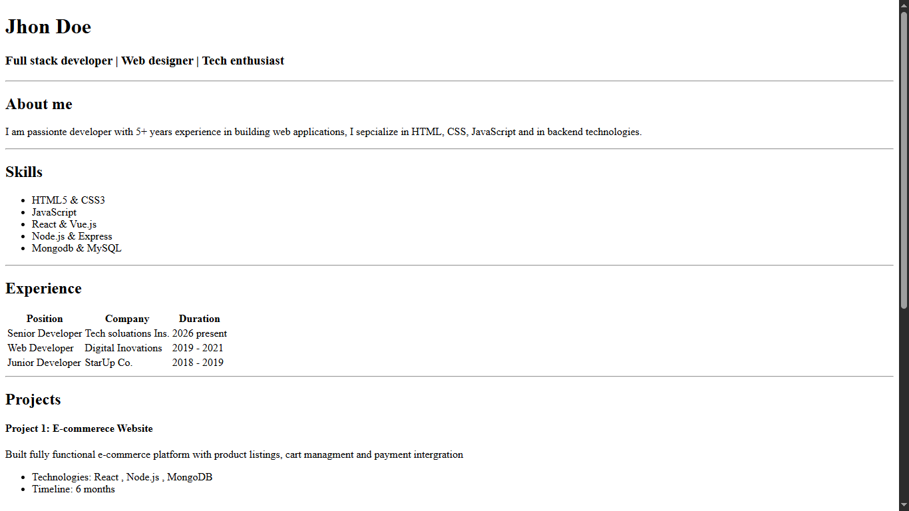

### How to step this project

1. Clone this repository to your local machine using `https://github.com/asgharali97/cohort_2.0_fundamentals`
2. Open the project folder in your text editor or IDE of choice.
3. Move into the `html` folder and open the `index.html` file in your web browser to view the project.
5. To run the project, install live server extention and use that

### resume screenshot

